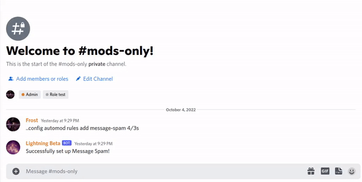

# AutoMod Configuration

Lightning's AutoMod can be setup via message or slash commands!

---

Run `.help automod` to start!

## Advanced AutoMod

These rules are considered advanced because you can set the interval for them.

Advanced AutoMod rules can be located below. 

| Name | Description |
| ---- | ----------- |
| message-spam | Controls how many messages a user can send in the server during &#60;x&#62; seconds |
| mass-mentions | Controls how many mentions can be sent in &#60;x&#62; seconds |
| url-spam | Controls how many links can be sent in &#60;x&#62; seconds |
| invite-spam | Controls how many Discord invites can be sent in &#60;x&#62; seconds |
| message-content-spam | Controls how many messages containing the same content can be sent during &#60;x&#62; seconds |

## Basic AutoMod

Basic AutoMod rules are rules that only do one action and cannot be customized!

| Name | Description |
| ---- | ----------- |
| auto-dehoist | Dehoists server members if they have any characters in their name that are used for hoisting |
| auto-normalize | Normalizes a member's display name |

## Setting up an AutoMod rule

- `automod rules add`

If you're wanting to set up a Basic AutoMod rule, you'll need to use `automod rules addbasic` instead!

## Removing an AutoMod rule

- `automod rules remove`

## AutoMod Ignores

### Setting up AutoMod ignores

- `automod ignore`

You can add roles, members, and channels to the ignored list.


If you add a channel to the ignored list, AutoMod will ignore all messages in that channel.


### Removing an ignore

- `automod unignore`


If you don't know what is currently ignored, use `automod ignored`


### Who is ignored by AutoMod?

The following are checked in the following order to determine if you are ignored from AutoMod:

- You have a higher role than the bot does.
- You are exempt from AutoMod by permission level configuration
    - Either you're specifically added to a permission level or have a role that is Trusted or higher
- You are exempt from AutoMod by AutoMod Default Ignores

