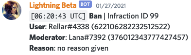
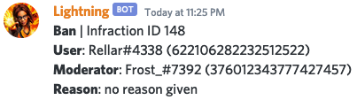
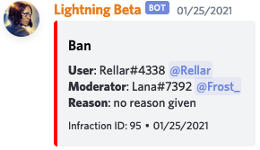
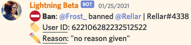

# Bot Configuration

For additional help, join the [support server](https://short.lightsage.dev/discord)

## Customizing the bot's prefix

By default, the bot's prefix is it's mention (@Lightning) and cannot be removed.

Run `@Lightning config prefix` to manage custom prefixes in a nice menu!

## Logging

### Events

| Event | Description | Audit Log Integration |
| :----- | :---------- | :------------------- |
| Warn | Logs when the warn command is used. | Not Applicable |
| Kick | Logs when a member is kicked. | ✅ |
| Ban | Logs when a member is banned. | ✅ |
| Mute | Logs when the mute or timemute command is used. | Not Applicable |
| Unmute | Logs when the unmute command is used. | Not Applicable |
| Unban | Logs when a user is unbanned. | ✅ |
| Member Join | Logs when a member joins a server. | Not Applicable |
| Member Leave | Logs when a member leaves a server. | Not Applicable |
| Member Role Add | Logs when roles are added to a member | ✅ |
| Member Role Remove | Logs when roles are removed from a member | ✅ |
| Member Nick Change | Logs when a nickname is added/changed/removed from a member | ✅ |

### Logging Formats

Lightning includes 4 formats in which you can receive logs.



A simple, minimal format.




Same as minimalistic except it doesn't include a timestamp.




An embedded format aiming to be simple and without useless clutter.




A format based on an emoji style of logging.




To configure the format, use `.config logging` and follow the prompts.

## Fine-Tuned Command Permissions

### Levels

Levels allow you set certain roles or members as a certain level in the bot.

To set up a level, use `.config permissions add <member/role>` to add and `.config permissions remove <member/role>` to remove.

#### Admin

Admins are the highest in power with Lightning. They can configure anything on the bot freely and use any command.


You should only give people you trust the most the Admin level.


#### Mod

Moderators are the members of your server who police the server.
Mods cannot configure the bot, but they can use a range of commands that help moderate the server.

#### Trusted

Trusted are people in your server that you trust. They don't have access to moderation commands and cannot configure the bot. They are exempt from Auto-mod.

### Disabling commands

To disable a command from being run in your server, run `.config permissions blockcommand <command>`.

To undo this, run `.config permissions unblockcommand <command>`.


No one, not even the server owner, can bypass this restriction unless they add a command override.


### Explicit Command Allows

Overrides the current permissions required for a command, so that the role or user can use the command.

To do this, run `.config permissions commandoverrides add <command> <user/role>`

If you want change the level for a command, run `.config permissions commandoverrides changelevel <command> <level>`

To undo all overrides for a command, run `.config permissions commandoverrides removeall <command>`


The bot owner/devs are not responsible for any damage that may happen. Use it wisely.

