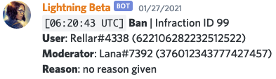
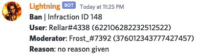
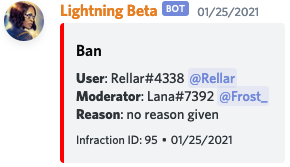
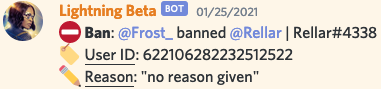

# Mod Log

Lightning can log moderation activity to one or more channels. You can choose exactly which events go to which channel.

To get started, run the `modlog` command and follow the prompts.

## Quick setup

1. Run `modlog`.
2. Pick a log channel (staff-only recommended).
3. Select the events you want logged.
4. Pick a log format.

## Events

Lightning currently supports these events:

| Event | Description | Audit Log Integration |
| :----- | :---------- | :------------------- |
| Warn | Logs when the warn command is used. | Not Applicable |
| Kick | Logs when a member is kicked. | ✅ |
| Ban | Logs when a member is banned. | ✅ |
| Mute | Logs when the mute or timemute command is used. | Not Applicable |
| Unmute | Logs when the unmute command is used. | Not Applicable |
| Unban | Logs when a user is unbanned. | ✅ |
| Member Join | Logs when a member joins a server. | Not Applicable |
| Member Leave | Logs when a member leaves a server. | Not Applicable |
| Member Role Add | Logs when roles are added to a member | ✅ |
| Member Role Remove | Logs when roles are removed from a member | ✅ |
| Member Nick Change | Logs when a nickname is added/changed/removed from a member | ✅ |
| Infraction Update | Logs when either the reason or moderator is updated for an infraction | Not Applicable |

## Logging Formats

Lightning includes 4 log formats.



A simple format with a timestamp.




Same minimal style, without timestamp.




A clean embed format.




An emoji-based style.




To change format later, run `.modlog` again and update your settings.

## Tips

- Use a private staff channel for moderation events.
- If logs seem incomplete, verify that the event is enabled for the channel.
- For events with audit log integration, make sure Lightning has the required server permissions.
