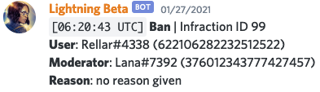
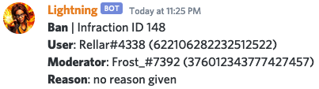
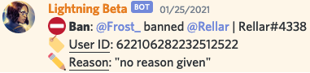

# Mod Log

To start setting up the modlog, use the `modlog` command. Use the reference below if you are confused about anything.

<% hint style="info" %>
Lightning's mod logging supports multiple modlog channels with any number of events.

Now you can customize your server's mod logs any way you want! 🎉
<% endhint %>

## Events

Lightning's modlog currently supports the following events:

| Event | Description | Audit Log Integration |
| :----- | :---------- | :------------------- |
| Warn | Logs when the warn command is used. | Not Applicable |
| Kick | Logs when a member is kicked. | ✅ |
| Ban | Logs when a member is banned. | ✅ |
| Mute | Logs when the mute or timemute command is used. | Not Applicable |
| Unmute | Logs when the unmute command is used. | Not Applicable |
| Unban | Logs when a user is unbanned. | ✅ |
| Member Join | Logs when a member joins a server. | Not Applicable |
| Member Leave | Logs when a member leaves a server. | Not Applicable |
| Member Role Add | Logs when roles are added to a member | ✅ |
| Member Role Remove | Logs when roles are removed from a member | ✅ |
| Member Nick Change | Logs when a nickname is added/changed/removed from a member | ✅ |

## Logging Formats

Lightning includes 4 formats in which you can receive logs.



A simple, minimal format.




Same as minimalistic except it doesn't include a timestamp.




An embedded format aiming to be simple and without useless clutter.




A format based on an emoji style of logging.




To configure the format, use `.modlog` and follow the prompts.