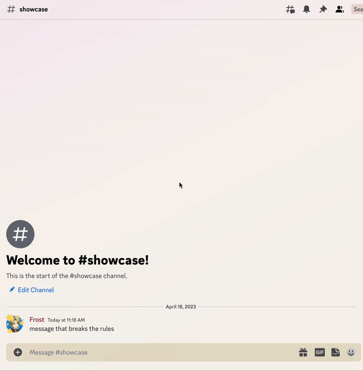
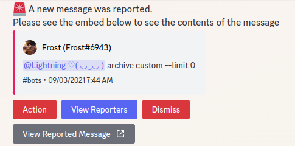

# Message Reports

Lightning includes a powerful, easy-to-use message reporting system.

## Set Up

Type `@Lightning reportsetup`. 

Click or tap the Set report channel button. Then, select the channel you want reports sent to. 

**This channel should be accessible only to your server's moderators and admins.**

Once you finished, your server's members will now be able to report suspicious or rule breaking messages.

## How to report messages

Right-click on a message, hover over Apps, and click Report Message.

Once you get a confirmation, the message will show up in your configured reports channel.

Included below is an example of how to report messages.

### Message Report Dashboard

When a member reports a message, a new message will appear in your configured reports channel. This will allow your moderators to decide what to do with the message.

Here's a quick breakdown of all the buttons you will see.

#### Action
This button will allow you to set some sort of punishment for the reported message author.

#### View Reporters
This button will allow you see who reported the message and their reasoning for reporting it.

#### Dismiss
This button will allow you to dismiss the report. You can re-open it again if you accidentally dismissed it.

#### View Reported Message
This button will show you where exactly the message was and its full contents.