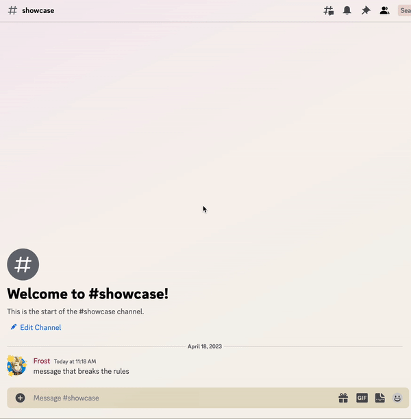
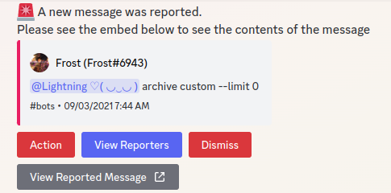

# Message Reports

Lightning includes a built-in system for members to report suspicious or rule-breaking messages.

## Set Up

Run `@Lightning reportsetup`.

Click **Set report channel**, then select where reports should be sent.

Use a private channel that only moderators/admins can access.

Once set, members can start reporting messages immediately.

## How to report messages

Members can report messages by right-clicking a message, opening **Apps**, and clicking **Report Message**.

After confirmation, the report appears in your configured reports channel.

Included below is an example of how to report messages.

### Message Report Dashboard

Each report creates a dashboard message for staff, so moderators can review and act quickly.

Here's a quick breakdown of all the buttons you will see.

#### Action
Apply a moderation action to the message author.

#### View Reporters
See who reported the message and their reasons.

#### Dismiss
Close the report if no action is needed. You can reopen it later if needed.

#### View Reported Message
Jump to the original message location and view its full content.

## Tips

- Encourage members to include a clear reason when reporting.
- Keep report channels staff-only to avoid leaking reporter identity.
- Review older dismissed reports occasionally for repeat patterns.
