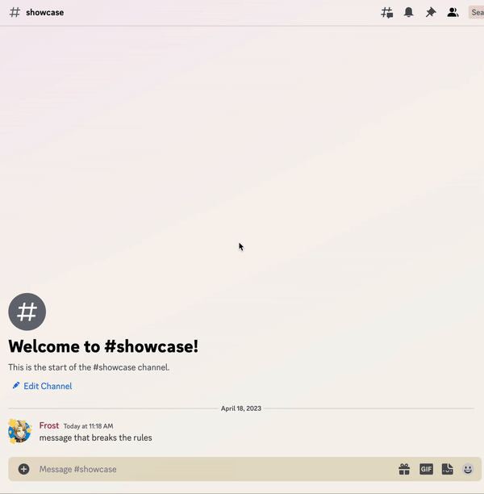
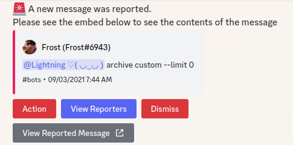

# Message Reports

Lightning includes a built-in system for members to report suspicious or rule-breaking messages.

## Set Up

Run `{{ selected_prefix }}reportsetup`.

Click **Set report channel**, then select where reports should be sent.

Use a private channel that only moderators/admins can access.

Once set, members can start reporting messages immediately.

## How to report messages

Members can report messages by right-clicking a message, opening **Apps**, and clicking **Report Message**.

After confirmation, the report appears in your configured reports channel.

Your identity is kept confidential from server moderators. They can see your report reason and when you submitted it, but Lightning does not show them your name or user ID.


Confidential reporting is not complete anonymity. Lightning keeps reporter IDs internally for abuse prevention and enforcement, and your reason or the conversation may reveal who you are. Avoid including identifying details in your reason unless they are needed for the report.


Report submissions are excluded from public command statistics, including `{{ selected_prefix }}stats` and `{{ selected_prefix }}stats auditlog`.

Included below is an example of how to report messages.

### Message Report Dashboard

Each report creates a dashboard message for staff, so moderators can review and act quickly.

The example above shows an older dashboard. New reports also include **View Context**.

Here's a quick breakdown of all the buttons you will see.

#### Action
Apply a moderation action to the message author.

#### View Reporters
See report reasons and submission times, labeled **Confidential Reporter #1**, **Confidential Reporter #2**, and so on. Reporter names and user IDs are hidden from moderators on both older and new dashboards.

#### View Context
Open a private moderation context view that only you can see. It includes:

- The reported member's join date and account creation date, when available.
- The number of reports against that member in your server in the last 30 days.
- A summary of their five most recent infractions, grouped by action and reason.
- Up to three messages before and three messages after the reported message, along with message text, attachment links, and a link to the original message.

Conversation context is fetched when you click the button. If the reported message is deleted or Lightning cannot access the channel history, that part of the view is unavailable. Long conversations may be shortened.


Older dashboards keep their existing buttons and do not gain **View Context**. Their reports are not included in the context view's report count because they do not have a saved reported-user ID. The 30-day count is a review window, not a deletion period.


#### Dismiss
Close the report if no action is needed. You can reopen it later if needed.

#### View Reported Message
Jump to the original message location and view its full content.

## Tips

- Encourage members to include a clear reason when reporting.
- Keep report channels staff-only to protect reported messages, report reasons, and moderation details.
- Review older dismissed reports occasionally for repeat patterns.
